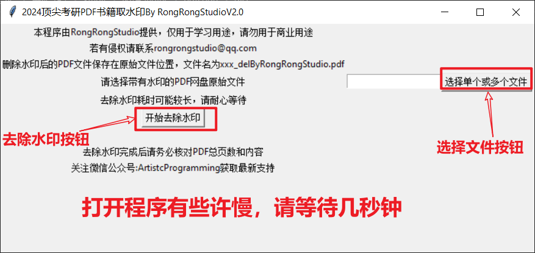
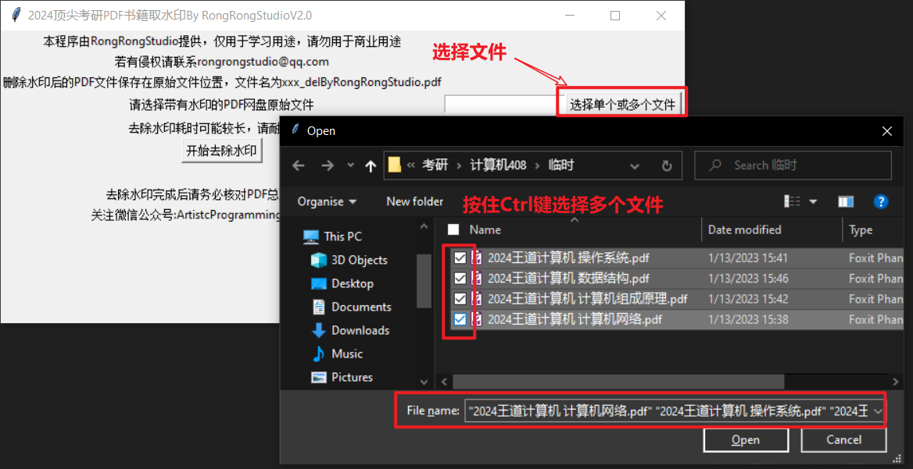
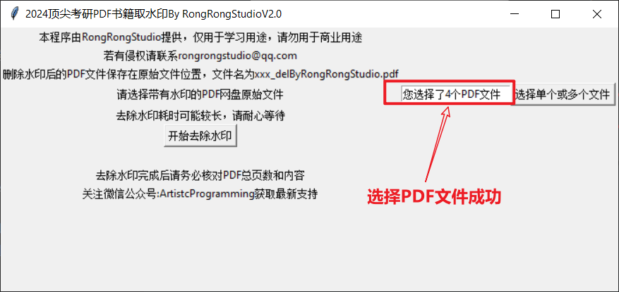
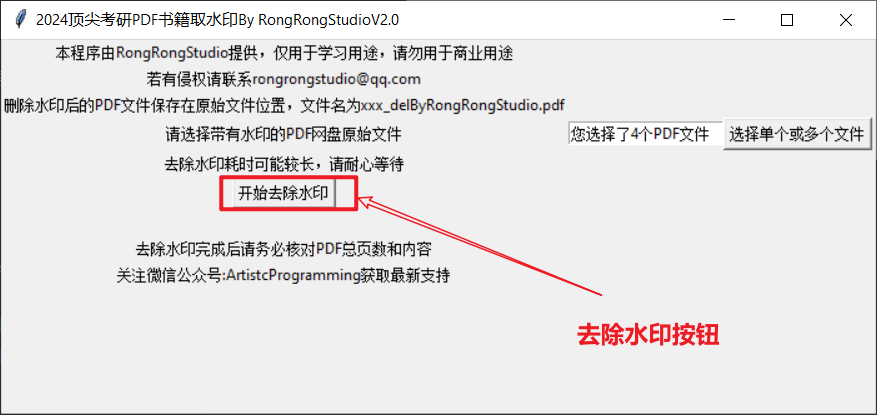
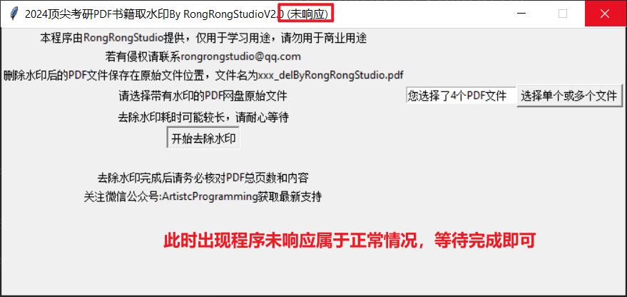
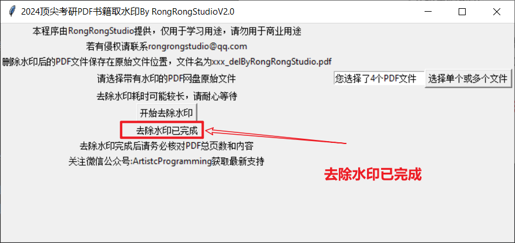
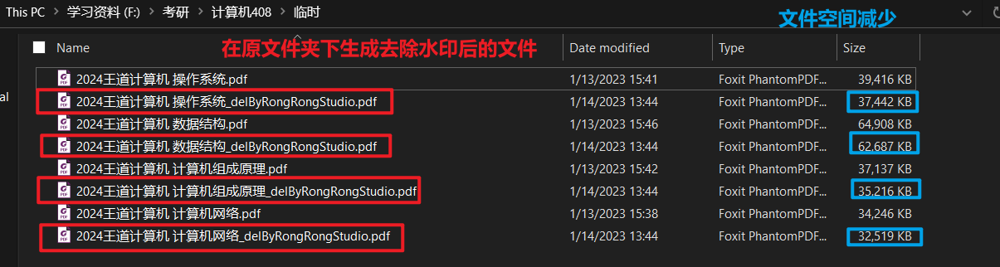
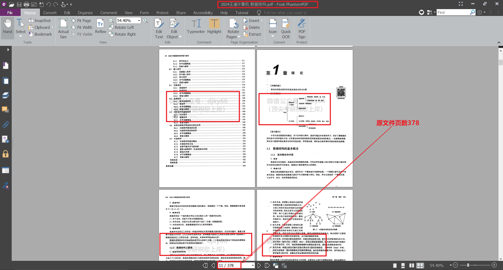
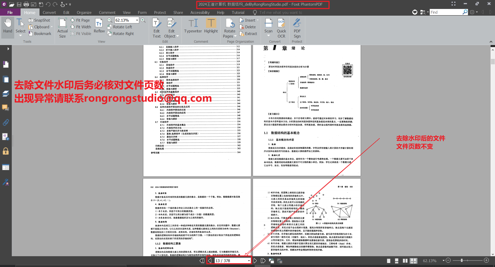

# 2024顶尖考研PDF去除水印，由RongRongStudio提供技术支持。若有侵权，请联系rongrongstudio@qq.com删除。微信公众号:ArtistcProgramming

## 1.项目环境

Win10、Python3.8.10、PyCharm Professional2022.3.1

## 2.开发说明

### 2.1克隆代码

```bash
git clone https://github.com/RongRongStudio/2024DingJianKaoYanPdfHandler.git
```

### 2.2PyCharm创建虚拟环境

选择Virtualenv创建虚拟环境

### 2.3导入Python库

```bash
pip install -r requirements.txt -i https://mirrors.aliyun.com/pypi/simple/
```

### 2.4运行

```bash
python main.py
```

### 2.5打包exe

```bash
Pyinstaller -F -w main.py
```

打包结果在dist/main.exe

## 3.使用说明

### 3.1下载链接

https://rongrongstudio.lanzouw.com/i1Uim0kyvaof

### 3.2选择单个或多个需要去除水印的原始网盘PDF文件

**将要去除水印的PDF文件放在同一文件夹下**








### 3.3点击开始去除水印

**去除水印耗时较长，请耐心等待**

**下面以2024王道计算机 四件套进行展示**









### 3.4去除水印效果对比

原PDF文件

以2024王道计算机 数据结构为例进行展示



**去除水印后的文件**



**去除文件水印后务必核对文件页数，出现异常联系rongrongstudio@qq.com**

## 4.反馈

**若出现Bug请联系rongrongstudio@qq.com或在微信公众号ArtistcProgramming进行留言**

**若您觉得此程序对你有用，可以赞助一下一个鸡腿哈！将持续的进行更新**


​      